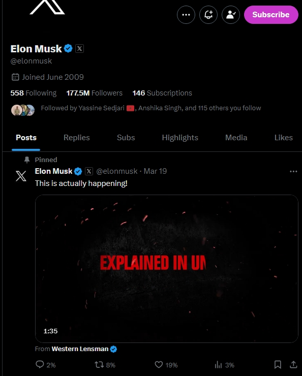

# Reach Ratio - See Your Real Engagement!

A simple Chrome extension, See Your Real Engagement!, converts interactions on Twitter into a percentage relative to the number of your followers and the level of interaction.

When you go to any profile page all tweets this profile has will be a percentage relative to the number of its followers.

## Screenshot

`before`


`After`



## Built with

-   **Extension API:** Chrome Extension V3
-   **Language:** TypeScript

## Working Principle

`MutationObserver`

```ts
const pageUpdateObserver = new MutationObserver(
    (mutationsList: MutationRecord[]) => {
        for (const mutation of mutationsList) {
            if (
                mutation.type === "childList" &&
                mutation.addedNodes.length > 0
            ) {
                const addedElement = mutation.addedNodes[0] as HTMLElement;

                // Code...
            }
        }
    }
);
pageUpdateObserver.observe(document.body, {
    childList: true,
    subtree: true,
});
```

## To Do

-   add options to pop-up
-   add an option for every way % can be (what happens if less than 1%, ...)
-   Get followers numbers when not on the profile page
-   make it work on every page for every tweet

### From the developer

Uploading this extension to the extension web store requires additional money and effort, so if you want to use this extension, you can download it and use it locally on your device [learn more](https://bashvlas.com/blog/install-chrome-extension-in-developer-mode)

## Useful resources

Check out my latest previous articles:

-   [Top 5 websites to sharpen your front-end skills.](https://dev.to/ymhaah/top-5-websites-to-sharpen-your-front-end-skills-3ao0)
-   [Why couldn't you get a job as a freelancer?](https://dev.to/ymhaah/why-couldnt-you-get-a-job-as-a-freelancer-1jm8)
-   [Top 5 Icon websites for devs and designers!!!](https://dev.to/ymhaah/top-5-icon-websites-for-devs-and-designers-53mh)
-   [30-Day React Learning Journey!](https://dev.to/ymhaah/series/20473)

## Author

-   professional links:
    -   [Twitter / X](https://twitter.com/hafanwy)
    -   [LinkedIn](https://www.linkedin.com/in/youssef-hafnawy/)
    -   [Newsletter](https://hefnawystudio.substack.com/?utm_source=navbar&utm_medium=web&r=31jf6o)
-   Hire me:
    -   [UpWork](https://www.upwork.com/freelancers/~01acd8e5370e5646aa)
-   Blog:
    -   [Medium](https://medium.com/@ymhaah250)
    -   [Dev.to](https://dev.to/ymhaah)

### Free Services

-   [Free Website performance Optimization](https://tally.so/r/nPzKaB)
-   [Free Website Accessibility Optimization](https://tally.so/r/3lr2bp)
